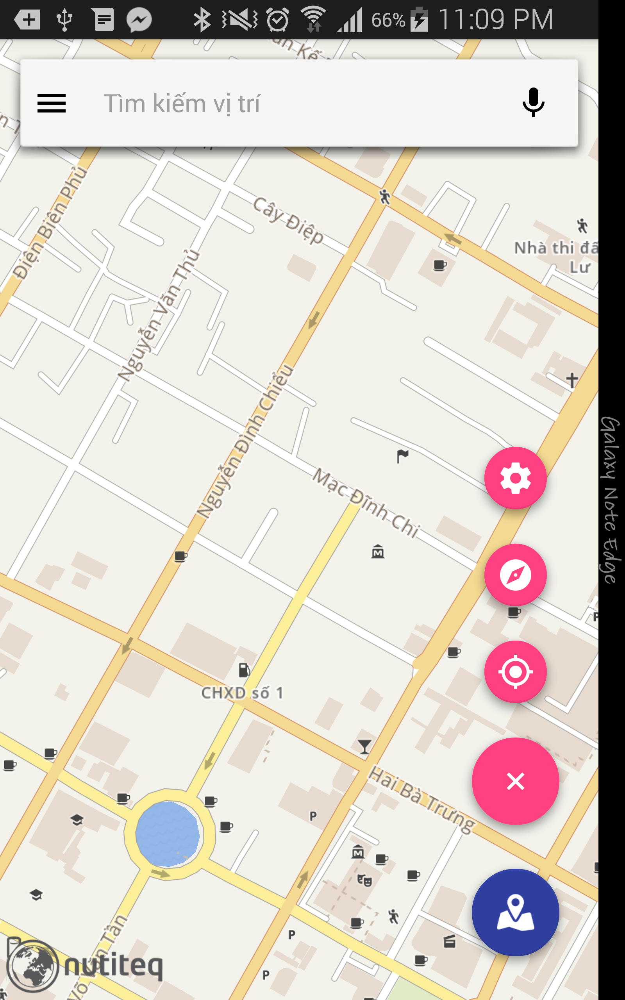
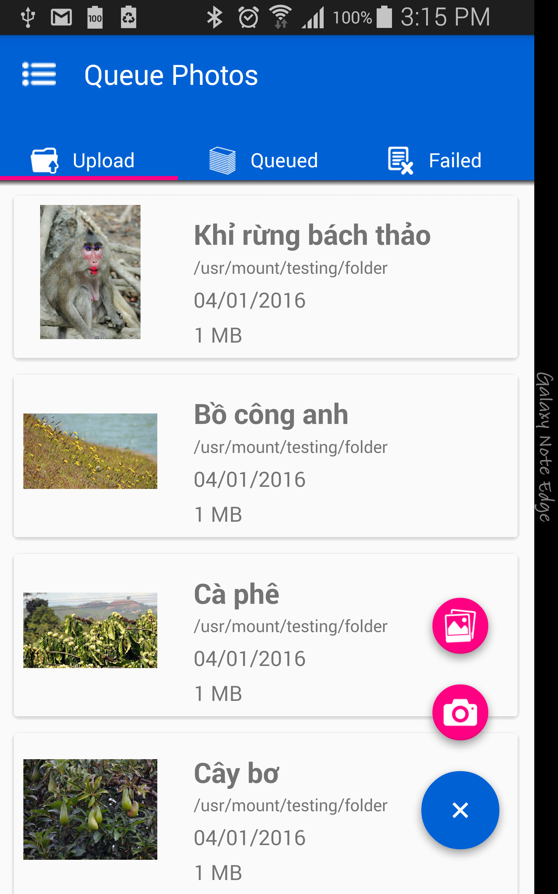
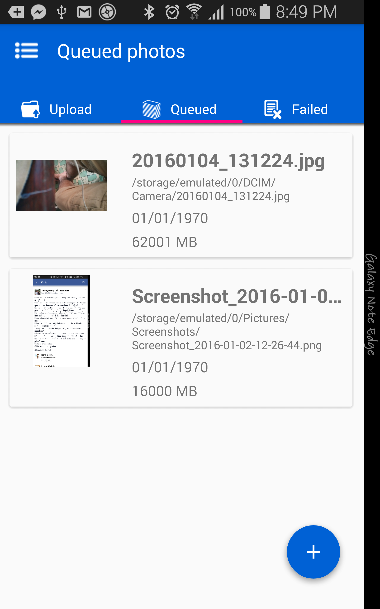
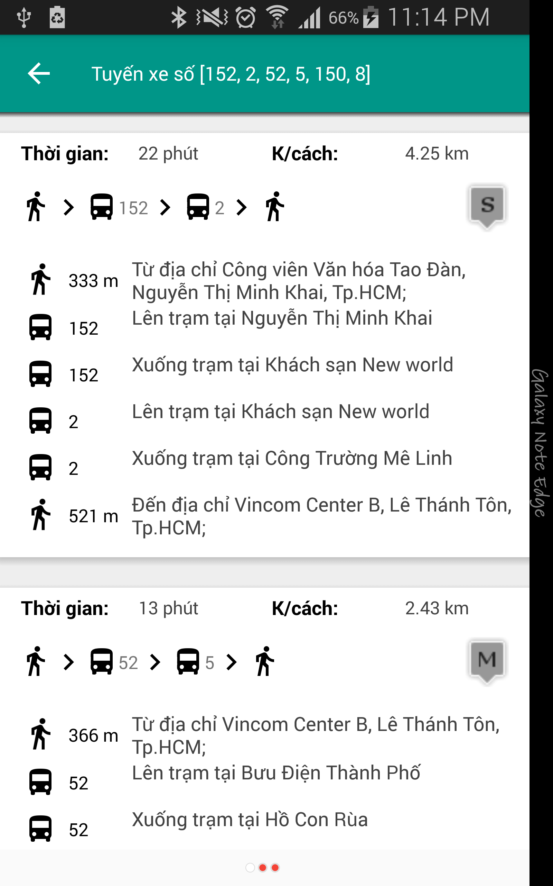
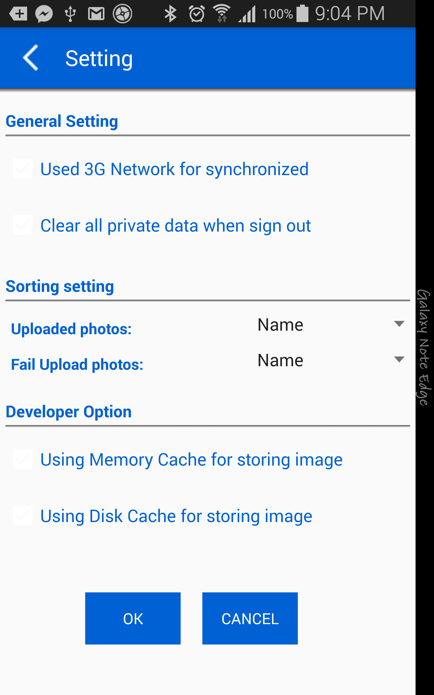

#  iUploader
Application for uploading images to Flickr Service. This application is for Silicon Straits testing purpose.

# This application provided:
- Uploading images to Flickr service 
- Supporting queue upload images for uploading multi images.
- Preview and view images before uploading.
- Can easily extend to upload to Picasa service.

# What it looks like

<table>
  <tr>
    <td><b>Main screen</b></td>
    <td><b>Bus Search Screen</b></td>
    <td><b>Motor Search Screen</b></td>
  </tr>
  <tr>
    <td>&nbsp;&nbsp;&nbsp;</td>
    <td>&nbsp;&nbsp;&nbsp;</td>
    <td>&nbsp;&nbsp;&nbsp;</td>
  </tr>
</table>

<table>
  <tr>
    <td><b>Bus Detail Screen</b></td>
    <td><b>Optional Parameter Screen</b></td>
    <td><b>Detail Map Screen</b></td>
  </tr>
  <tr>
    <td>&nbsp;&nbsp;&nbsp;</td>
    <td>&nbsp;&nbsp;&nbsp;</td>
    <td>&nbsp;&nbsp;&nbsp;</td>
  </tr>
</table>

<table>
  <tr>
    <td><b>Wear Detail Map</b></td>
    <td><b>Wear Notification</b></td>
  </tr>
  <tr>
    <td>&nbsp;&nbsp;&nbsp;</td>
    <td>&nbsp;&nbsp;&nbsp;</td>
  </tr>
</table>

# Technologies
- Server: Java Servlet, Hibernate, MySQL, Redis
- Algorithm: <a href="http://research.microsoft.com/pubs/156567/raptor_alenex.pdf">Raptor algorithm (Microsoft, 2012)</a>
- Android Development
    - Material Layout implementation
    - <a href="http://www.nutiteq.com/apps/offline-maps-3d/">Nutiteq Map Offline technology</a>
    - GPS Technology
    - Google Direction API, Google Map API, Google Autocomplete API
- Android Wear Development
