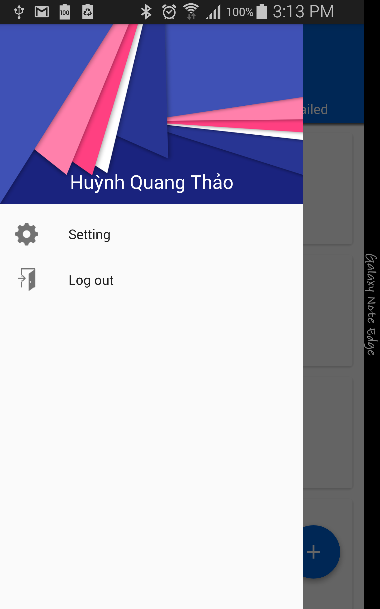

#  iUploader
Application for uploading images to Flickr Service. This application is for Silicon Straits testing purpose.

# This application provided:
- Uploading images to Flickr service 
- Supporting queue upload images for uploading multi images.
- Preview before uploading.
- Can easily extend to upload to Picasa service.
- Using File cache, memory cache and optimize image for increasing performance.

# What it looks like

<table>
  <tr>
    <td><b>Login Screen</b>></td>
    <td><b>Uploaded Photo Screen</b></td>
    <td><b>Queue Photo Screen</b></td>
  </tr>
  <tr>
    <td>&nbsp;&nbsp;&nbsp;</td>
    <td>&nbsp;&nbsp;&nbsp;</td>
    <td>&nbsp;&nbsp;&nbsp;</td>
  </tr>
</table>

<table>
  <tr>
    <td><b>Preview Photo Screen</b></td>
    <td><b>Navigation Drawer Screen</b></td>
    <td><b>Setting Screen</b></td>
  </tr>
  <tr>
    <td>&nbsp;&nbsp;&nbsp;</td>
    <td>&nbsp;&nbsp;&nbsp;</td>
    <td>&nbsp;&nbsp;&nbsp;</td>
  </tr>
</table>

# Libraries
- **Flikrj-android:** Flickr Restful API Wrapper for Android.
- **EventBus:** Using for transfer data between activity and activity, activity and service ...
- **Realm:** Mobile ORM Database, supports many platforms such as Android, iOS .. and is proved faster than normal SQLite Database
- **Material libraries:** libraries for implementing Google material design guideline. (RecycleView, FloatingButtonAction, ...)

# Extending Google Picassa Uploading Service
 **Note:** Picassa uses Oath2 and Flickr uses Oath for authentication. Nevertheless, This difference doesn't have big affect because we use built-in api libraries for those services.

## API Detail
 Here is some list APIs for implementing Picassa upload function:

### Processing between android and Picassa serice
 Using <a href="https://developers.google.com/picasa-web/?hl=en">Picasa Web Albums API</a>

### Login to Picasa Service
For single-user:
```java
PicasawebService myService = new PicasawebService("huynhquangthao@gmail.com");
myService.setUserCredentials("huynhquangthao@gmail.com", "password");
```

For dynamic login: Similar with Flickr API, need to call Picasa service for getting session token.
<a href="https://developers.google.com/picasa-web/docs/1.0/developers_guide_java">Reference link</a> 

### Uploading API 
 - Link: <a href="https://developers.google.com/picasa-web/docs/2.0/developers_guide_java?csw=1#UploadPhotos">Uploading Photo API</a>
 - Sample Code:
 ```java
URL albumPostUrl = new URL("https://picasaweb.google.com/data/feed/api/user/username/albumid/albumid");

PhotoEntry myPhoto = new PhotoEntry();
myPhoto.setTitle(new PlainTextConstruct("Puppies FTW"));
myPhoto.setDescription(new PlainTextConstruct("Puppies are the greatest."));
myPhoto.setClient("myClientName");

MediaFileSource myMedia = new MediaFileSource(new File("/home/liz/puppies.jpg"), "image/jpeg");
myPhoto.setMediaSource(myMedia);
PhotoEntry returnedPhoto = myService.insert(albumPostUrl, myPhoto);
```

### Download Photo API
Example code:
 ```java
// read all photos from an album
URL feedUrl = "https://picasaweb.google.com/data/feed/api/user/username/albumid/albumid";

AlbumFeed feed = myService.getFeed(feedUrl, AlbumFeed.class);

for(PhotoEntry photo : feed.getPhotoEntries()) {
    MediaSource mediaSource = photo.getMediaSource();
    InputStream photoInputStream = mediaSource.getInputStream();
    // read from the photoInputStream here to get contents of photo
}
 ```

## Architecture Detail
This application also make easily for extending new uploaded services by decoupling between view(activity, fragment) and model(service, task, ...).
In detail, application uses **Manager** class (based Factory Method design pattern) for choosing accurated implement classes. I decide not to choose some Dependency Injection frameworks (such as Dagger, Google Guice) because maybe application will be supports both two services at Runtime.
- **TaskManager:** Management how should generate a task for an View. 

Base on above assumptions, this application needs from 2-3 days for extending Picasa uploading function including intergration testing time.

# Testing
Testing project is stored under `src/test`. I create two sample test screen : `SettingActivity` and `ImageListActivity`. Using two main libraries:
 - **JUnit4** for unit test
 - **espresso** and **espresso-intent** for instrument testing
